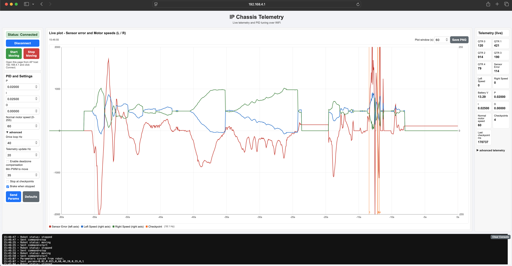

# IP Motorshield Firmware


## Getting started

A more detailed step-by-step guide is available on Moodle in the [Mini-Sprint 0.2 "Bauen" / I.1) Quick Start Guide Chassis](https://moodle-app2.let.ethz.ch/mod/book/view.php?id=1410163&chapterid=29267).

1. Download and install Arduino IDE from https://www.arduino.cc/en/software
2. Install "esp32 by Espressif Systems" from the Boards Manager in Arduino IDE.
3. Install the libraries used in this project through the Library Manager in Arduino IDE:
    1. "Adafruit NeoPixel" (https://github.com/adafruit/adafruit_neopixel)
    2. "QTRSensors Pololu" (https://docs.arduino.cc/libraries/qtrsensors/)
    3. "WebSockets Markus Sattler" (by user Links2004 used for the ESP32 web interface (https://docs.arduino.cc/libraries/websockets/))


After the software setup above, you can flash the firmware onto the ESP32 using Arduino IDE by selecting the correct board "ESP32S3 Dev Module" and port, and clicking the upload button.

The firmware supports two operating modes controlled by the `ENABLE_WEB_INTERFACE` flag in `ip-motorshield/config.h`:


#### Standalone mode (`ENABLE_WEB_INTERFACE 0`)

1. Flash the firmware using Arduino IDE.
2. Place the robot in the middle of the black line on a track and power it on.
3. The robot performs the same calibration routine as in web interface mode.
4. After calibration the LED turns **solid cyan** for 3 seconds as a countdown, then the robot starts moving automatically.
5. The LED blinks cyan while the robot is running.

#### Web interface mode (`ENABLE_WEB_INTERFACE 1`)

Set `#define ENABLE_WEB_INTERFACE 1` in `ip-motorshield/config.h` before flashing to run the robot with the web interface via WiFi.

1. Flash the firmware using Arduino IDE.
2. Place the robot in the middle of the black line on a track and power it on. The LED should light up briefly and then turn blue.
3. The robot should start the calibration routine where it will rotate **first to the left, then to the right, and finally back to the center**. In case it does not rotate correctly or the LED blinks in red, check the polarity of the motor wiring and swap direction if necessary.
4. After calibration the LED should blink in green, indicating that the robot is ready and waiting for a web interface connection.
5. Connect your computer to the `IP-Motorshield-XXXXXX` WiFi network (password: `motorshield`) and open `http://192.168.4.1` in a browser and click the button to connect to the robot (see below for details).
6. Upon successful connection, the LED should now blink in orange and you can let the robot move by clicking the button in the web interface.
7. You can also tune the PID and motor parameters while the robot is running and see the effect right after clicking "Send Params".

## Hardware

#### Motorshield itself
- ESP32-S3-WROOM-1-N16R8 DevKit from Waveshare (see https://www.waveshare.com/wiki/ESP32-S3-DEV-KIT-N8R8)
- 6x DRV8251ADDAR motor drivers. There are direct GPIO connections for low latency control from the ESP32 for M1 and M2, and the remaining 4 drivers are controlled through an PWM expander (PCA9685) over I2C. 
- Motor current, battery voltage and supply voltage sensing is done with two external ADS1015 ADCs over I2C. 
- Another PCA9685 PWM expander is used to control up to 8 servors.
- Additionally, there is one MCP23017 GPIO expander for general purpose IO, such as LEDs, endstops, etc.

#### Robot
- QTR-MD-05RC reflectance sensor 5x array from Pololu (2.9 V to 5.5 V, see https://www.pololu.com/product/4145)

## MCP23017 GPIO Expander

The MCP23017 is a GPIO expander that provides 7 additional user I/Os (`Mcp23017::Pin::B0..Mcp23017::Pin::B6`) on this board.

Direct ESP32 GPIO and MCP23017 GPIO are not equivalent:

- Use MCP23017 for slower auxiliary I/O (for example: buttons, LEDs, endstops, status lines).
- Use direct ESP32 GPIO for time-critical or high-frequency signals (for example: motor encoders and QTR sensor signals).

This project includes an MCP23017 driver in `ip-motorshield/src/drivers/mcp23017.h` and `ip-motorshield/src/drivers/mcp23017.cpp`.


### Initialization

No extra MCP initialization is needed in application code. The MCP23017 is initialized together with the rest of the motorshield in `Motorshield::begin()`.

### pinMode (direction + pull-up)

Use `mcp.pinMode(pin, mode)` with pins from the `Mcp23017::Pin` enum:

- `OUTPUT`: configures pin as output
- `INPUT`: configures pin as input (no pull-up)
- `INPUT_PULLUP`: input with internal pull-up enabled

```cpp
mcp.pinMode(Mcp23017::Pin::B0, OUTPUT);
mcp.pinMode(Mcp23017::Pin::B1, INPUT);
mcp.pinMode(Mcp23017::Pin::B2, INPUT_PULLUP);
```

### Write (digitalWrite)

Use `mcp.digitalWrite(pin, value)` to set output level:

```cpp
mcp.pinMode(Mcp23017::Pin::B0, OUTPUT);
mcp.digitalWrite(Mcp23017::Pin::B0, HIGH);
mcp.digitalWrite(Mcp23017::Pin::B0, LOW);
```

### Read (digitalRead)

Use `mcp.digitalRead(pin)` to read current pin state (`HIGH`/`LOW`):

```cpp
mcp.pinMode(Mcp23017::Pin::B1, INPUT_PULLUP);
int state = mcp.digitalRead(Mcp23017::Pin::B1);
```

### Interrupt + endstop example

Example use case: normally-open endstop on `B0`.

Wiring:

- Endstop one side -> MCP `B0`
- Endstop other side -> GND
- Use `INPUT_PULLUP` so idle is `HIGH`, pressed is `LOW`

The MCP23017 interrupt output (`INTB`) is optional on this board and needs hardware + firmware setup:

1. Close solder bridge `A3` on the motorshield PCB to route MCP `INTB` to ESP32 GPIO6.
2. In `ip-motorshield/pinout.h`, uncomment `#define MCP23017_INTB_PIN (6)` (line **83**):

```cpp
#define MCP23017_INTB_PIN (6)
```

When this is enabled, ESP32 GPIO6 is dedicated to MCP interrupt input and cannot be used for other purposes.

3. In `setup()`, configure endstop pin and MCP interrupt source:

```cpp
mcp.pinMode(Mcp23017::Pin::B0, INPUT_PULLUP);
mcp.setupInterrupts();
mcp.setupInterruptPin(Mcp23017::Pin::B0);
mcp.getCapturedInterrupt(); // clears interrupt state
```

4. In `loop()`, consume the IRQ flag and handle triggered pin(s):

```cpp
if (shield.consumeGpioInterruptFlag()) {
    uint8_t flags = mcp.getInterruptFlags(); // flags: bitmask of which MCP pins triggered (B0..B6)
    uint8_t captured = mcp.getCapturedInterrupt(); // captured: pin snapshot at interrupt time; reading it also clears interrupt state
    uint8_t endstopMask = Mcp23017::pinMask(Mcp23017::Pin::B0);
    
    if (flags & endstopMask) {
        bool pressed = ((captured & endstopMask) == 0);
        // Handle endstop pressed/released here
    }
}
```

#### Interrupt parameters (advanced)

Default calls above are usually enough:

- `mcp.setupInterrupts()`
- `mcp.setupInterruptPin(Mcp23017::Pin::B0)`

Optional parameters:

- `setupInterrupts(mirror, openDrain, polarity)`
    - `mirror`: `true` mirrors INTA/INTB behavior, `false` keeps them independent. On this board only `INTB` is used, so this  has no practical effect for this PCB.
    - `openDrain`: `true` makes interrupt output open-drain
    - `polarity`: `LOW` active-low (default) or `HIGH` active-high
- `setupInterruptPin(pin, mode)`
    - `mode = CHANGE` (default): interrupt on both edges
    - `mode = LOW`: interrupt when pin is low
    - `mode = HIGH`: interrupt when pin is high

## ESP32 Web Interface

> **Note:** The web interface is disabled by default. Set `#define ENABLE_WEB_INTERFACE 1` in `config.h` to enable the web interface (see [Web interface mode](#web-interface-mode-enable_web_interface-1) above).



The ESP32-S3 starts its own WiFi access point named `IP-Motorshield-XXXXXX` (last 3 MAC bytes in hex) with password `motorshield`.

Connect to that network and open `http://192.168.4.1` in a browser. The page shows live telemetry over WebSockets and lets you tune PID and motor parameters while the line follower keeps running on the other core.


## Development

#### Compiling

You can simply compile the project with the Arduino IDE, but if you prefer command line, you can use the arduino-cli tool.

```sh
arduino-cli compile --fqbn esp32:esp32:esp32s3 ip-motorshield
```


#### Website editing

The web interface is served from `ip-motorshield/web-page.h`, which is generated from `ip-motorshield/web-page.html` by the `scripts/html_to_header.py` script (it minifies the HTML/CSS/JS and embeds it as a PROGMEM string). Never edit `web-page.h` by hand — edit `web-page.html` and regenerate.

One-time setup of the Python environment (the script needs the `minify-html` package from `scripts/requirements.txt`):

```sh
python3 -m venv .venv
.venv/bin/pip install -r scripts/requirements.txt
```

After every edit of `web-page.html`, regenerate the header and recompile:

```sh
.venv/bin/python scripts/html_to_header.py ip-motorshield/web-page.html ip-motorshield/web-page.h
```


#### Build & code metrics

`scripts/build_metrics.py` regenerates `web-page.h`, compiles the firmware and writes a summary (web page size, flash/RAM usage, C++ lines of code split by motorshield facade / web interface / other application code) to `scripts/metrics-summary.txt` (gitignored):

```sh
.venv/bin/python scripts/build_metrics.py
```

##### Standalone mode (`ENABLE_WEB_INTERFACE 0`)

> IP Motorshield firmware metrics  
> Generated: 2026-09-14T22:46:26  
> Git revision: 24b6f14  
> 
> Firmware build  
> &nbsp;&nbsp;Flash: 486721 / 1310720 bytes (37%)  
> &nbsp;&nbsp;RAM:   33008 / 327680 bytes (10%)  
> 
> C++ code lines (web-page.h excluded)    
> &nbsp;&nbsp; 850: Motorshield facade (src/)  
> &nbsp;&nbsp; 617: Other application code  
> &nbsp;&nbsp;1467: Total  

##### Web interface mode (`ENABLE_WEB_INTERFACE 1`)

Enabling the web interface increases flash usage by 40% and RAM usage by 5%:

> IP Motorshield firmware metrics  
> Generated: 2026-09-14T22:49:18  
> Git revision: 24b6f14-dirty  
> 
> Web page  
> &nbsp;&nbsp;web-page.html:        32094 bytes  
> &nbsp;&nbsp;web-page.h (minified): 22768 bytes (71% of original)  
> 
> Firmware build  
> &nbsp;&nbsp;Flash: 1015276 / 1310720 bytes (77%)  
> &nbsp;&nbsp;RAM:   49792 / 327680 bytes (15%)  
> 
> C++ code lines (web-page.h excluded)    
> &nbsp;&nbsp; 850: Motorshield facade (src/)  
> &nbsp;&nbsp; 477: Web interface  
> &nbsp;&nbsp; 617: Other application code  
> &nbsp;&nbsp;1944: Total  
